# AI Interview Copilot — System Design

## 1. Overview

AI Interview Copilot is an AI-assisted interview-preparation platform.

The platform allows users to:

1. Create an account and authenticate.
2. Upload a PDF resume.
3. Select a target role and optionally provide a job description.
4. Receive a role-aligned ATS analysis.
5. Generate a configurable mock interview.
6. Complete general, DSA and machine-coding rounds.
7. Execute submitted code against visible and hidden test cases.
8. Receive per-answer feedback and scoring.
9. Complete the interview after answering every question.
10. Receive an overall assessment and personalized learning roadmap.
11. Review previous resumes and interview sessions.

## 2. Design goals

The system is designed around the following goals:

- Separate frontend, API, business logic and persistence concerns.
- Support multiple AI providers with automatic failover.
- Execute untrusted candidate code outside the application server.
- Persist resume analyses and interview history.
- Protect user-owned resources through authentication and authorization.
- Support both local development and containerized deployment.
- Allow resume storage to move from local disk to object storage.
- Validate application behavior through automated tests and CI.
- Allow incremental migration toward a production SaaS architecture.

## 3. High-level architecture

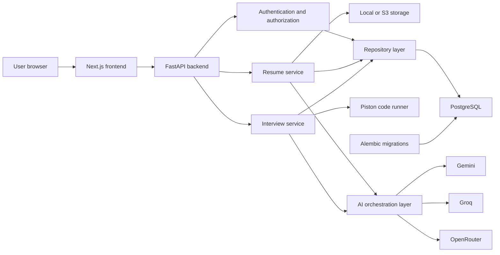

## 4. Technology stack

| Area | Technology |
|---|---|
| Frontend | Next.js 16 |
| UI | React 19, TypeScript, Tailwind CSS |
| Code editor | Monaco Editor |
| Backend | FastAPI |
| Validation | Pydantic |
| ORM | SQLAlchemy |
| Database | PostgreSQL |
| Vector support | pgvector |
| Migrations | Alembic |
| Authentication | JWT access tokens and rotating opaque refresh tokens |
| Password hashing | Passlib and bcrypt |
| AI providers | Gemini, Groq and OpenRouter |
| AI resilience | Retry logic and ordered provider failover |
| Code execution | Self-hosted Piston-compatible API |
| Resume parsing | pypdf |
| File storage | Local filesystem or S3-compatible storage |
| Rate limiting | SlowAPI |
| Testing | pytest and FastAPI TestClient |
| CI | GitHub Actions |
| Containers | Docker and Docker Compose |

## 5. Repository architecture

```text
AI_Interview_Copilot/
├── .github/
│   └── workflows/
│       └── ci.yml
├── client/
│   ├── app/
│   │   ├── dashboard/
│   │   ├── interview/
│   │   ├── login/
│   │   ├── register/
│   │   └── resume/
│   ├── components/
│   ├── lib/
│   │   ├── api.ts
│   │   ├── auth-context.tsx
│   │   └── types.ts
│   └── Dockerfile
├── server/
│   ├── alembic/
│   │   └── versions/
│   ├── app/
│   │   ├── ai/
│   │   ├── api/v1/
│   │   ├── core/
│   │   ├── db/
│   │   ├── models/
│   │   ├── repositories/
│   │   ├── schemas/
│   │   └── services/
│   ├── tests/
│   ├── Dockerfile
│   └── main.py
├── docs/
├── docker-compose.yml
└── docker-compose.prod.yml
```

## 6. Frontend design

The frontend is implemented with Next.js App Router.

### Responsibilities

The frontend handles:

- Registration and login forms
- Authentication state
- Access-token attachment
- Refresh-token requests
- Protected-route behavior
- Resume upload
- Resume-analysis presentation
- Interview-round selection
- Question navigation
- Monaco-based code editing
- Code-execution requests
- Answer submission
- Feedback presentation
- Interview completion
- Interview and resume history

### Important frontend files

| File | Responsibility |
|---|---|
| `client/lib/api.ts` | API communication, tokens and refresh handling |
| `client/lib/auth-context.tsx` | User authentication state |
| `client/components/protected-route.tsx` | Protected-page access |
| `client/app/register/page.tsx` | Account registration |
| `client/app/login/page.tsx` | User authentication |
| `client/app/dashboard/page.tsx` | Resume and interview overview |
| `client/app/resume/new/page.tsx` | Resume upload |
| `client/app/resume/[resumeId]/page.tsx` | Resume-analysis results |
| `client/app/interview/[sessionId]/page.tsx` | Interview experience |

### Registration flow

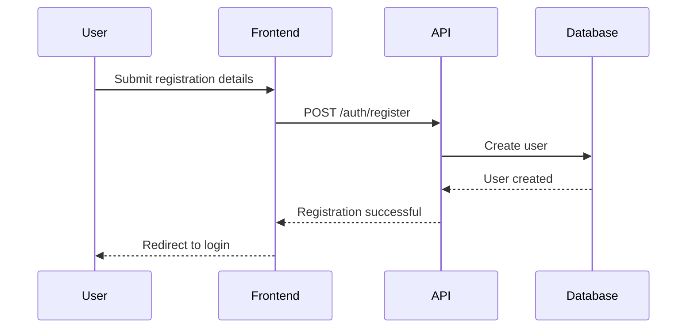

Registration does not automatically authenticate the user. The user must log in after account creation.

## 7. Backend design

The backend is organized into layers.

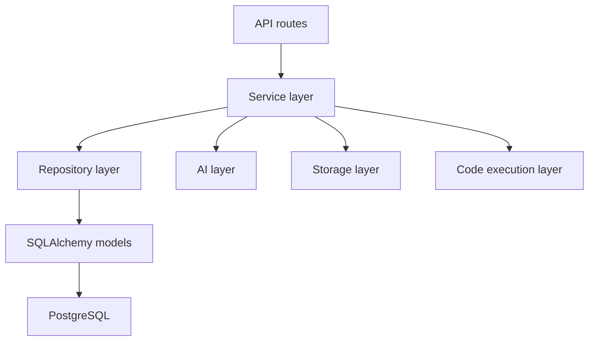

### API layer

Location:

```text
server/app/api/v1/
```

Responsibilities:

- Parse HTTP input.
- Apply authentication dependencies.
- Apply request rate limits.
- Validate ownership.
- Translate service errors into HTTP responses.
- Serialize response schemas.

Primary API modules:

- `auth.py`
- `resume.py`
- `interview.py`

### Service layer

Location:

```text
server/app/services/
```

Responsibilities:

- Implement business rules.
- Coordinate repositories.
- Call AI workflows.
- Execute candidate code through Piston.
- Coordinate resume extraction and storage.
- Control interview state transitions.

Primary services:

- `auth_service.py`
- `user_service.py`
- `resume_service.py`
- `interview_service.py`
- `code_execution_service.py`

### Repository layer

Location:

```text
server/app/repositories/
```

Responsibilities:

- Encapsulate database queries.
- Create and retrieve domain entities.
- Filter user-owned resources.
- Centralize commit, refresh and rollback operations.

The repository layer keeps most persistence details outside HTTP routes and business services.

### Schema layer

Location:

```text
server/app/schemas/
```

Pydantic schemas validate:

- Authentication payloads
- Resume requests and responses
- Interview-round configuration
- Answer submissions
- Code-execution payloads
- Session details
- Feedback and roadmap responses

### Model layer

Location:

```text
server/app/models/
```

SQLAlchemy models represent:

- Users
- Refresh tokens
- Resumes
- Resume analyses
- Interview sessions
- Interview questions
- Interview answers
- Interview feedback
- Learning roadmaps

## 8. Authentication design

The authentication system uses two token types.

### Access token

- JWT format
- Short lifetime
- Contains user identity and role claims
- Sent using the `Authorization: Bearer` header
- Validated by FastAPI dependencies

### Refresh token

- Cryptographically random opaque value
- Longer lifetime
- Stored as a SHA-256 hash in the database
- Rotated whenever it is used
- Revoked during logout
- Cannot be reused after rotation

### Authentication flow

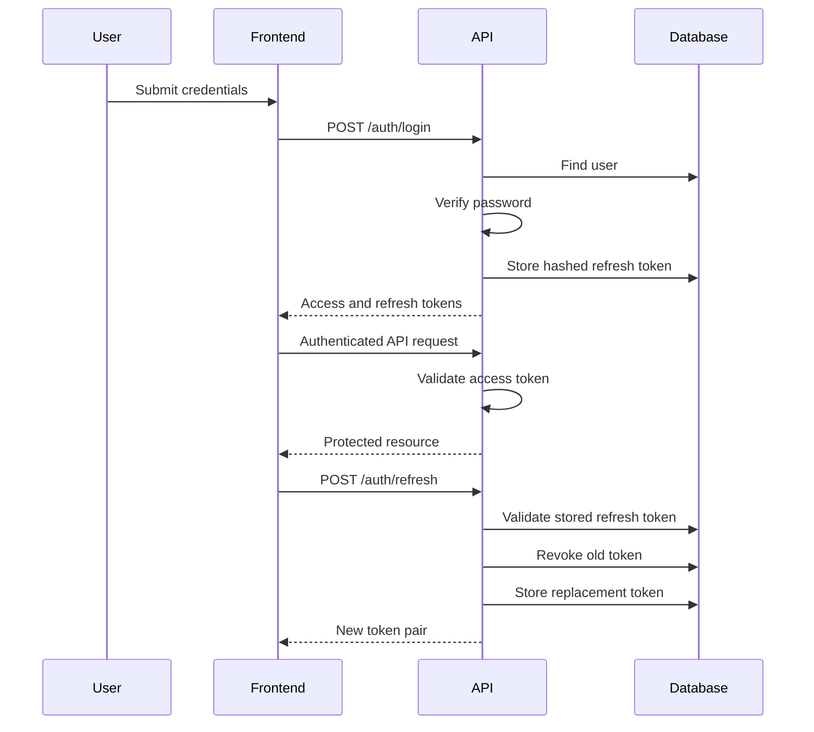

### Current authentication limitation

The frontend currently stores tokens in browser local storage. For stronger production security, the refresh token should move to an `HttpOnly`, `Secure` and appropriately configured `SameSite` cookie.

## 9. Resume-analysis workflow

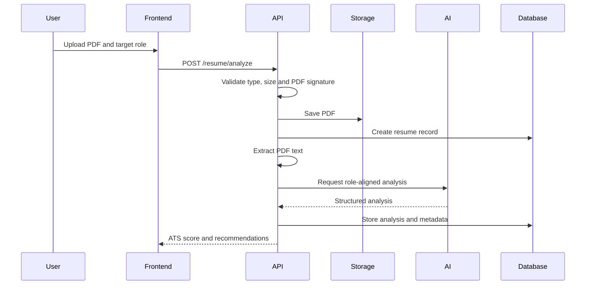

### Resume validation

The API checks:

- MIME type
- Maximum upload size
- PDF magic bytes
- Extractable text
- Authenticated ownership

### Resume storage

The storage abstraction supports:

- Local filesystem storage
- S3-compatible object storage

Local storage is appropriate for development and a single persistent API instance. Object storage is required for ephemeral or horizontally scaled deployments.

## 10. AI subsystem

Location:

```text
server/app/ai/
```

The AI subsystem separates prompt construction, provider communication, response parsing and schema validation.

### Components

| Component | Responsibility |
|---|---|
| Prompt registry | Selects the correct prompt implementation |
| Prompt builders | Generate task-specific prompts |
| Provider adapters | Communicate with external AI APIs |
| Provider chain | Tries providers in configured order |
| Retry layer | Retries transient provider failures |
| Parser | Converts structured JSON responses |
| Validator | Validates responses against Pydantic models |
| Orchestrator | Coordinates complete AI workflows |

### Provider failover

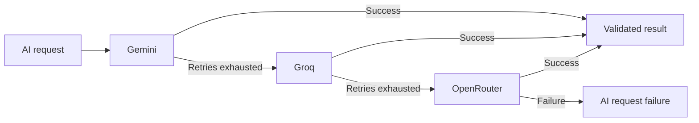

The provider order is configured through:

```env
AI_PROVIDER_CHAIN=gemini,groq,openrouter
```

Only providers included in the chain require API keys.

### Structured response processing

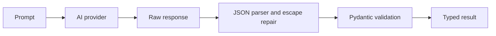

The parser can repair certain malformed escape sequences commonly returned in otherwise valid AI-generated JSON.

## 11. Interview lifecycle

### Interview creation

1. The user selects a previously analyzed resume.
2. The user selects one or more interview rounds.
3. The API confirms that the resume belongs to the authenticated user.
4. The AI layer generates questions for every configured round.
5. The API stores the interview session and questions.
6. The first unanswered question is returned.

### Supported round types

| Round | Evaluation |
|---|---|
| General | AI answer evaluation |
| DSA coding | Test-case score blended with AI review |
| Machine coding | AI code review, with optional execution |

### Interview state flow

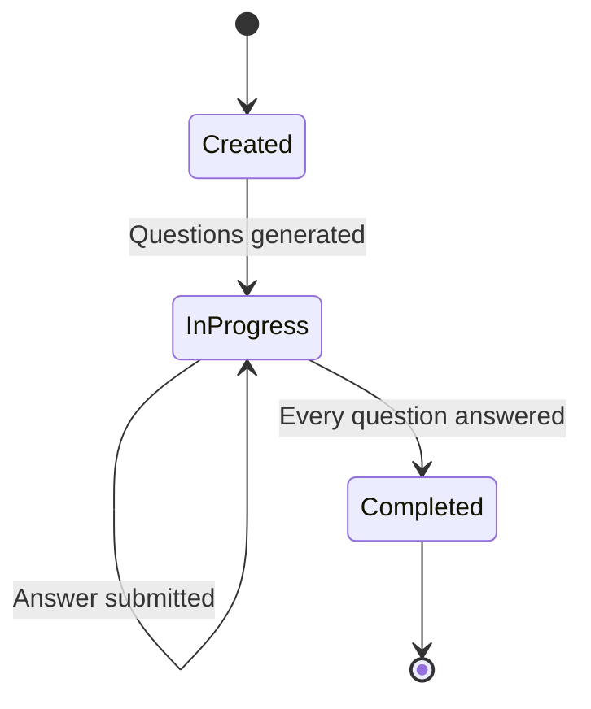

An interview cannot be completed while unanswered questions remain.

### Answer submission

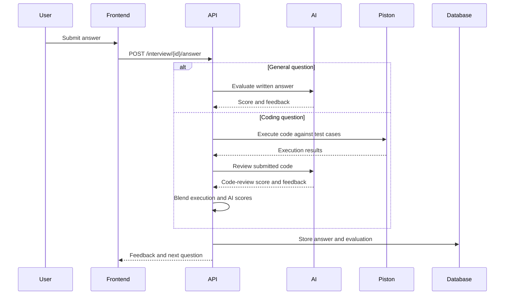

## 12. Code-execution design

Candidate code is never executed directly by the FastAPI process.

The backend sends code to a separate Piston-compatible execution API.

### Supported languages

| Application language | Piston language | Runtime version |
|---|---|---|
| Python | `python` | `3.12.0` |
| JavaScript | `javascript` | `20.11.1` |
| Java | `java` | `15.0.2` |
| C++ | `c++` | `10.2.0` |

### Visible and hidden tests

- Visible test cases are returned to the candidate.
- The run-code operation executes only visible test cases.
- Answer submission executes visible and hidden test cases.
- Hidden test cases are not serialized in question responses.
- DSA scoring uses the final test-case pass ratio and AI review.

### DSA scoring

```text
Final score = 70% test-case score + 30% AI review score
```

Machine-coding tasks without automated tests use the AI review score.

### Security boundary


Production Piston should:

- run separately from FastAPI;
- use privileged Linux infrastructure required by its isolation model;
- disable outgoing networking for submitted programs;
- enforce CPU, memory, process and output limits;
- remain inaccessible directly from the public internet;
- require private-network or authenticated access;
- apply account-level quotas.

## 13. Database design

### Main relationships

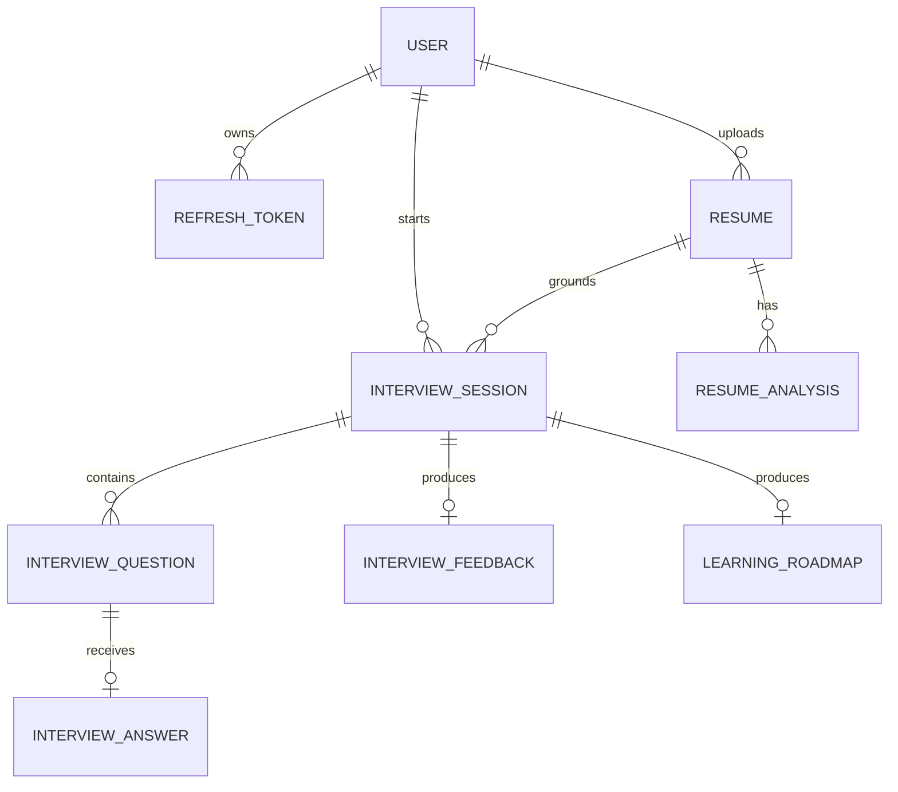

### Persistence principles

- User ownership is checked before returning resumes or sessions.
- Refresh tokens are stored as hashes.
- A question can have only one submitted answer.
- A session has at most one final feedback record.
- A session has at most one learning roadmap.
- JSON columns store structured arrays such as strengths, test cases and roadmap items.
- Foreign-key cascades remove dependent records where configured.

### Migrations

Alembic owns schema changes.

The CI migration job verifies that the complete migration chain can initialize a fresh PostgreSQL database.

A future CI improvement should also:

1. Initialize a database at an older revision.
2. Insert representative data.
3. Upgrade to the latest revision.
4. Confirm that all existing data remains intact.

## 14. Rate limiting

SlowAPI applies limits to sensitive or expensive routes, including:

- Registration
- Login
- Token refresh
- Resume analysis
- Interview generation
- Answer evaluation
- Code execution
- Interview completion

The current limiter is process-local and primarily keyed by IP address.

For multi-instance production deployment, replace it with:

- Redis or another shared store;
- authenticated-user-based keys;
- plan and account quotas;
- trusted-proxy configuration.

## 15. Error handling and observability

The system currently provides:

- Request logging
- Request duration logging
- Exception tracebacks
- Provider and model metadata
- AI processing time metadata
- Stored failure status for resume analysis
- Health endpoint
- Container health checks

Recommended production additions:

- Request and correlation IDs
- Centralized error monitoring
- AI-provider latency metrics
- Provider failure and fallback metrics
- Piston execution metrics
- Database connection monitoring
- Audit events
- Readiness endpoint
- External uptime monitoring

## 16. Testing strategy

### Backend tests

The pytest suite covers:

- Health endpoint
- Registration and login
- Refresh-token rotation
- Logout
- Authorization
- Rate limiting
- Resume upload and analysis
- Resume storage
- Interview generation
- Interview answer submission
- Interview completion rules
- Mixed interview rounds
- Piston execution integration boundaries
- AI prompts
- Provider behavior
- JSON parsing
- Structured response validation

Tests use:

- In-memory SQLite
- Fake AI providers
- Fake code execution
- Disabled rate limiting unless explicitly tested

### CI pipeline

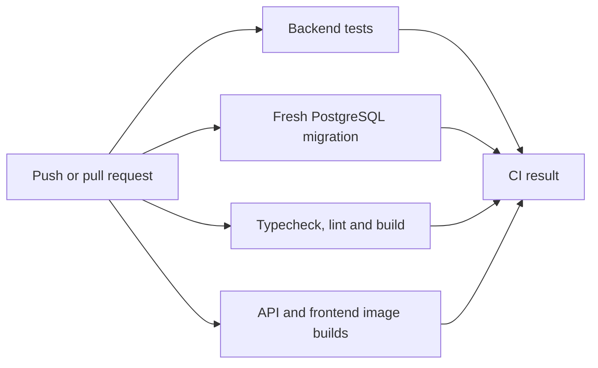

GitHub Actions currently performs CI, not direct deployment.

## 17. Deployment architecture

### Local development

```text
Next.js on localhost:3000
FastAPI on localhost:8000
PostgreSQL on localhost:5432
Piston on localhost:2000
```

### Personal beta

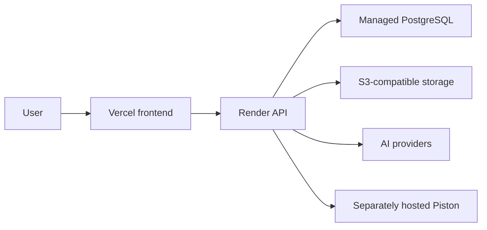

### Single-host deployment

`docker-compose.prod.yml` runs:

- PostgreSQL
- FastAPI
- Next.js

Piston runs as a separate privileged container.

A reverse proxy terminates TLS and routes frontend and API traffic.

## 18. Scalability considerations

The current architecture is appropriate for a personal project and early beta.

Before horizontal scaling:

- Move local files to S3-compatible storage.
- Move rate limiting to Redis.
- Move AI workflows to background jobs.
- Use a shared job queue.
- Add idempotency for expensive requests.
- Use managed PostgreSQL connection pooling.
- Separate migration execution from application startup.
- Introduce account-level AI and code-execution quotas.
- Scale Piston independently from FastAPI.
- Add caching where safe.
- Track provider and per-user costs.

## 19. Security considerations

Current protections include:

- Password hashing
- JWT validation
- Rotating refresh tokens
- Refresh-token hashing
- User-resource ownership checks
- PDF MIME and signature validation
- Upload-size limits
- Hidden test-case filtering
- Externalized code execution
- CORS configuration
- Rate limiting
- Environment-based secrets

Recommended production improvements:

- Move refresh tokens to secure HttpOnly cookies.
- Add CSRF protection where required.
- Add email verification.
- Add password reset and recovery.
- Add account deletion and data export.
- Add security headers.
- Add Content Security Policy.
- Add dependency and container scanning.
- Add secret scanning.
- Authenticate backend-to-Piston requests.
- Add object-retention and deletion policies.
- Add audit logging.
- Validate production proxy configuration.
- Lock backend dependency versions.

## 20. Known limitations

- AI calls execute synchronously within HTTP requests.
- Rate limiting is not shared across API instances.
- Browser tokens are stored in local storage.
- Local resume storage supports only one persistent instance.
- Piston requires separate infrastructure.
- The application does not implement billing or subscriptions.
- Account-level usage quotas are not implemented.
- Email verification and password recovery are not implemented.
- pgvector is provisioned but not yet used for retrieval-grounded generation.
- No voice or video interview mode exists.
- CI does not automatically deploy the application.
- The migration chain needs populated-database upgrade testing.

## 21. Planned SaaS evolution

A production SaaS version should introduce:

1. Background AI jobs.
2. Redis-backed queues and rate limiting.
3. Secure cookie-based refresh sessions.
4. Email verification and password recovery.
5. Account deletion and data export.
6. Subscription and entitlement models.
7. Per-user usage ledgers.
8. AI and code-execution quotas.
9. Billing-webhook handling.
10. Administrative monitoring.
11. Centralized error and performance monitoring.
12. Privacy, retention and deletion policies.
13. Deployment environments for development, staging and production.
14. Data-preserving migration tests.
